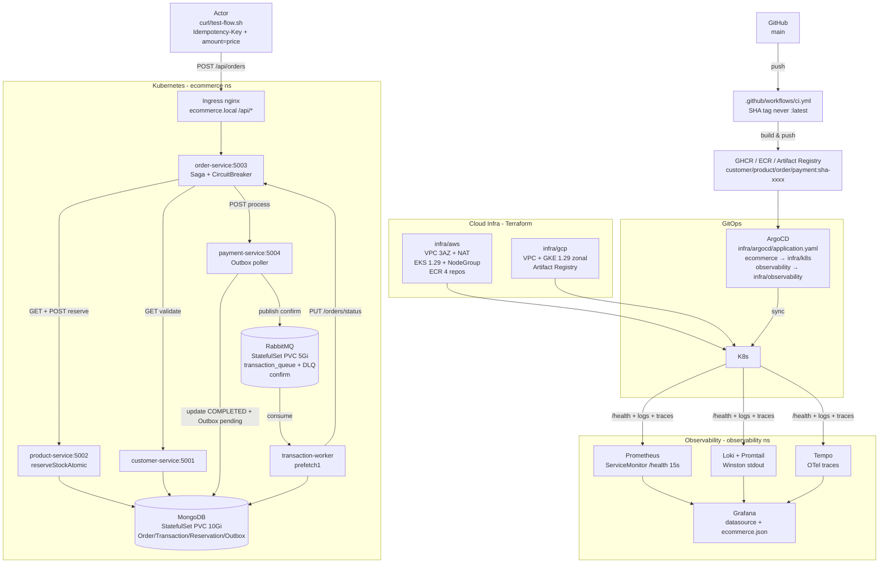

# Infra — Docker Compose ↔ Kubernetes (AWS / GCP)

Learning project: keep `docker-compose.yaml` at repo root for local dev, `infra/` is **separate** reference for Kubernetes. No app code or Dockerfile changes — same images `services/*/Dockerfile` run in both.

```
                          ┌──────────────────────────────────────┐
                          │  docker compose up --build           │  ← local, 7 containers
                          │  or                                  │    interchangeably
                          │  kubectl apply -k infra/k8s/         │  ← k3d/minikube/EKS/GKE
                          └──────────────────────────────────────┘
                                         │
                    ┌────────────────────┼────────────────────┐
                    │                    │                    │
              ┌─────▼─────┐        ┌─────▼─────┐        ┌─────▼─────┐
              │  infra/k8s │        │ infra/aws │        │ infra/gcp │
              │  (generic) │        │ Terraform │        │ Terraform │
              └─────┬─────┘        └─────┬─────┘        └─────┬─────┘
                    │                    │                    │
                    └────────────────────┼────────────────────┘
                                         ▼
                              ┌──────────────────┐
                              │  Kubernetes      │
                              │  ecommerce ns    │
                              └──────────────────┘
```

## Architecture (mirrors README.md:46-80)

```
ACTOR → Ingress (nginx, host ecommerce.local, /api/*) 
      → Service ClusterIP → Deployment 2 replicas (liveness/readiness GET /health)
                              │
                              ▼
                    order-service:5003 (Saga orchestrator)
```
*Compose* and *K8s* share same flow — only platform changes (`docker-compose.yaml` bridge vs `infra/k8s` `ClusterIP`+`StatefulSet` PVC).

## Diagram — Infra (Terraform + K8s + GitOps + LGTM)



> `docker compose up --build` (7 containers, `ecommerce-network`) and `kubectl apply -k infra/k8s/overlays/dev` (k3d) or `.../production` (`EKS`/`GKE` via `infra/aws|gcp` Terraform) run **same images** (`services/*/Dockerfile` `oven/bun→node:26-alpine`).

## Data Flow — Infra (end-to-end, same as README:71 Order Flow)

```
1. Client (curl/test-flow.sh)  ── POST /api/orders {customerId,productId,amount} + Idempotency-Key ──► Ingress nginx:80 ──► Service order-service:5003
2. order-service ── GET http://customer-service:5001/api/customers/:id ──► customer-service:5001 ──► MongoDB:27017 (StatefulSet mongodb, PVC 10Gi) ──► validate 200/404
3. order-service ── GET http://product-service:5002/api/products/:id ──► product-service:5002 ──► MongoDB ──► validate + price*qty check (order.service.ts:48 strict 0.01)
4. order-service ── POST http://product-service:5002/api/products/reserve {productId,quantity, idempotencyKey} ──► product-service ──► MongoDB StockReservation (idempotencyKey unique) + Product.findOneAndUpdate(stock:{$gte:qty}, $inc:-qty) atomic ──► 200 or 400 Insufficient stock → order FAILED
5. order-service ── POST http://payment-service:5004/api/payments/process {customerId,orderId,amount,productId, idempotencyKey} ──► payment-service:5004 ──► MongoDB Transaction (pending→completed) + Outbox pending (same DB) ──► publishWithRetry → RabbitMQ:5672 transaction_queue (durable, confirm, x-dead-letter → transaction_queue_dlq) (payment.service.ts:70, rabbitmq.ts:92)
6. RabbitMQ transaction_queue ──► transaction-worker:1 (Deployment, command node dist/workers/transaction.worker.js, prefetch1, noAck:false) ──► MongoDB Transaction update + PUT http://order-service:5003/api/orders/status {orderId, status:paid} ──► order.service.ts:118 idempotent PENDING→PAID
7. order-service ──► returns 201 {customerId,orderId,productId,orderStatus:pending, paymentStatus:pending} immediately (background payment), then polling GET /api/orders/:id → paid
8. MongoDB persists Order + Transaction + StockReservation + Outbox (published) — surviving pod restarts via PVC (compose: mongodb_data volume, k8s: volumeClaimTemplates). Outbox poller payment.service.ts:127 retries pending every 10s if publish failed.

Infrastructure data paths:

* **Config** `infra/k8s/base/configmap.yaml` + `Secret app-secrets` (MONGODB_URI, RABBITMQ_URL) → env `shared/utils/config.ts:27` (no hardcoded admin:password) → all Deployments; overlays patch `replicas` + `images` (SHA).
* **AWS** `infra/aws/main.tf` VPC 10.0.0.0/16 3AZ public/private + NAT → EKS 1.29 private nodes → ECR 4 repos (customer/product/order/payment, immutable SHA tag via `.github/workflows/ci.yml` `update-k8s` job, never :latest) → `kubectl apply -k infra/k8s/overlays/production` with image `<account>.dkr.ecr...:sha-xxxx`
* **GCP** `infra/gcp/main.tf` VPC + GKE 1.29 zonal + Artifact Registry `us-central1-docker.pkg.dev/<project>/ecommerce` → same base manifests, image `<region>-docker.pkg.dev/...:sha-xxxx`
* **GitOps** `infra/argocd/application.yaml` ArgoCD Application `ecommerce` syncs `infra/k8s/overlays/production` → `ecommerce` ns, `ecommerce-observability` syncs `infra/observability` → `observability` ns (automated prune/selfHeal).
* **Observability** `infra/observability/` LGTM: Promtail tails Winston stdout (`shared/utils/logger.ts:28` Console only in prod) → Loki:3100, `ServiceMonitor` scrapes `/health` 15s → Prometheus:9090 → Grafana:3000 datasource + `ecommerce.json` dashboard (Order Rate, Outbox Pending, Circuit State, Queue Depth), Tempo for `shared/utils/middleware.ts:68` traces. All via `helm upgrade --install kube-prometheus-stack/loki/tempo` then `kubectl apply -k infra/observability/` (or ArgoCD).
```

* **Compose** `docker-compose.yaml`: 7 containers, `ecommerce-network` bridge, `mongodb_data`/`rabbitmq_data` volumes, `wget /health` probes.
* **K8s** `infra/k8s/base`: `Namespace`, `ConfigMap` (same env as compose), `Secret` (MONGODB_URI), `StatefulSet` mongodb/rabbitmq (PVC), `Deployment 2 replicas` for 4 services + `transaction-worker` (`command: node dist/workers/transaction.worker.js`), `Service ClusterIP`, `Ingress nginx` `/api/*`. `infra/k8s/overlays/{dev,production}` patch replicas/images. Proven `kubectl apply --dry-run=client -k infra/k8s/overlays/dev` and `.../production` ok.

## Layout (kustomize base/overlays — best practice)

```
infra/
├── README.md          # this file
├── k8s/               # generic K8s, works on k3d/minikube/EKS/GKE — base/overlays
│   ├── base/          # DRY common — no env drift
│   │   ├── namespace.yaml, configmap.yaml, secrets.example.yaml, ingress.yaml
│   │   ├── mongodb/{service,statefulset}.yaml
│   │   ├── rabbitmq/{service,statefulset}.yaml
│   │   ├── customer-service/{deployment,service}.yaml (5001)
│   │   ├── product-service/{deployment,service}.yaml (5002)
│   │   ├── order-service/{deployment,service}.yaml (5003)
│   │   ├── payment-service/{deployment,service}.yaml (5004)
│   │   ├── transaction-worker/deployment.yaml
│   │   └── kustomization.yaml # images: ghcr.io/orinameh/*:v1.0.0 (never :latest)
│   └── overlays/
│       ├── dev/kustomization.yaml        # replicas:1, same images
│       └── production/kustomization.yaml # replicas:2-3, SHA via CI, commonLabels env:production
├── aws/               # Terraform EKS (VPC 3AZ, EKS 1.29, NodeGroup, ECR 4 repos)
│   ├── versions.tf, variables.tf, main.tf (VPC+EKS+ECR), outputs.tf
│   └── terraform.tfvars.example
├── gcp/               # Terraform GKE (VPC, GKE 1.29 zonal, Artifact Registry)
│   ├── versions.tf, variables.tf, main.tf (VPC+GKE+AR), outputs.tf
│   └── terraform.tfvars.example
├── argocd/            # GitOps — Application ecommerce → overlays/production
│   └── application.yaml, values.yaml
└── observability/     # LGTM — ServiceMonitor, Grafana datasources, Loki
    └── kustomization.yaml
```

## Interchange

```bash
# Local (unchanged)
docker compose up --build
bash test-flow.sh # amount=price per order.service.ts:48 strict check, Idempotency-Key required

# K8s local (k3d) — base/overlays
k3d cluster create ecommerce --port 8080:80@loadbalancer
# build images (same Dockerfiles, SHA tag — never :latest, CI does this)
for s in customer-service product-service order-service payment-service; do
  docker build -f services/$s/Dockerfile -t ghcr.io/orinameh/$s:$(git rev-parse --short HEAD) .
  k3d image import ghcr.io/orinameh/$s:$(git rev-parse --short HEAD) -c ecommerce
done
cp infra/k8s/base/secrets.example.yaml infra/k8s/base/secrets.yaml # edit MONGODB_URI (gitignored)
# dev overlay (1 replica, fast)
kubectl apply -k infra/k8s/overlays/dev
# production overlay (2-3 replicas, SHA via CI)
# kubectl apply -k infra/k8s/overlays/production
kubectl -n ecommerce rollout status deployment/order-service
kubectl -n ecommerce port-forward svc/order-service 5003:5003 &
bash test-flow.sh

# Back to compose
kubectl delete -k infra/k8s/overlays/dev --ignore-not-found
docker compose up --build
```

## Cloud (Terraform)

**AWS EKS** (`infra/aws/`):
```bash
cd infra/aws
cp terraform.tfvars.example terraform.tfvars # edit region/cluster_name
terraform init
terraform plan
terraform apply # creates VPC, 3AZ subnets, NAT, EKS 1.29, NodeGroup t3.medium 2-4, ECR 4 repos
aws eks update-kubeconfig --region us-east-1 --name ecommerce-eks
# push images
aws ecr get-login-password | docker login --username AWS --password-stdin <account>.dkr.ecr.us-east-1.amazonaws.com
for s in customer-service product-service order-service payment-service; do
  docker build -f services/$s/Dockerfile -t <account>.dkr.ecr.us-east-1.amazonaws.com/ecommerce/$s:v1.0.0 . # or :$(git rev-parse --short HEAD)
  docker push <account>.dkr.ecr.us-east-1.amazonaws.com/ecommerce/$s:v1.0.0
done
# update infra/k8s/* image: <ecr_url> then
kubectl apply -k ../k8s/
```

**GCP GKE** (`infra/gcp/`):
```bash
cd infra/gcp
cp terraform.tfvars.example terraform.tfvars # set project_id
terraform init
terraform apply # VPC, GKE 1.29 zonal, Artifact Registry
gcloud container clusters get-credentials ecommerce-gke --zone us-central1-a --project <id>
gcloud auth configure-docker us-central1-docker.pkg.dev
for s in customer-service product-service order-service payment-service; do
  docker build -f services/$s/Dockerfile -t us-central1-docker.pkg.dev/<project>/ecommerce/$s:v1.0.0 . # or :$(git rev-parse --short HEAD)
  docker push us-central1-docker.pkg.dev/<project>/ecommerce/$s:v1.0.0
done
kubectl apply -k ../k8s/
```

*Terraform backends are `local` for learning — switch to `s3+dynamodb` (AWS) / `gcs` (GCP) commented in `versions.tf` for team.*

## Why K8s Will Work

* Same `Dockerfile` (`oven/bun` builder → `node:26-alpine` runner, `wget` healthcheck) — no `shared/` path assumption (baked via `bun build --external mongoose`).
* `shared/utils/config.ts:27` requires `MONGODB_URI` from Secret (no `admin:password` fallback in code), `base/configmap.yaml` mirrors compose env, `overlays/production` patches `replicas`/`resources`.
* `liveness/readinessProbe: GET /health` maps `docker-compose.yaml:121` `wget`.
* `StatefulSet` PVC replaces `mongodb_data`/`rabbitmq_data` volumes.
* `transaction-worker` same image as `payment-service`, `command` override — as `docker-compose.yaml:140`.
* Tested `kubectl apply --dry-run=client -k infra/k8s/base` + `-k infra/k8s/overlays/dev` + `-k infra/k8s/overlays/production` (see `infra/k8s/README.md`).

## Production Notes (README:145 Additional)

* Compose stays for dev; K8s for prod with HPA, PodDisruptionBudget, NetworkPolicy, `ingress` → API Gateway, `ArgoCD` sync `infra/k8s/`, `LGTM` (Loki/Grafana/Tempo/Mimir) via Helm.
